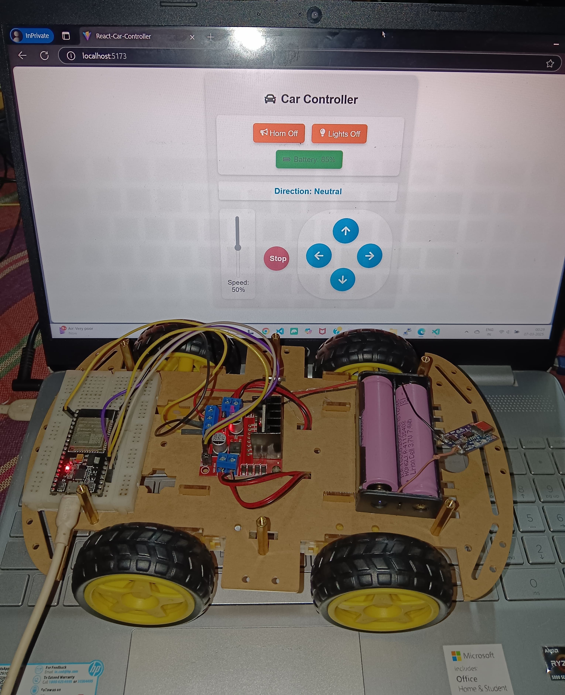

# ESP32 Car Control Wiring Guide

This guide explains how to wire the ESP32 to control a car's motors using the provided code. The code uses four GPIO pins to control two motors (e.g., for a simple 2-wheel drive car).

---

## Motor Control Pins
The following GPIO pins are used for motor control:

- `pin1` → GPIO4
- `pin2` → GPIO16
- `pin3` → GPIO17
- `pin4` → GPIO15

These pins are connected to an H-Bridge motor driver (e.g., L298N) to control the direction and speed of the motors.

---

## Wiring Diagram

.

```plaintext
ESP32 GPIO Pins       H-Bridge Motor Driver (L298N)
-----------------------------------------------
GPIO4 (pin1)    →     IN1 (Motor A Input 1)
GPIO16 (pin2)   →     IN2 (Motor A Input 2)
GPIO17 (pin3)   →     IN3 (Motor B Input 1)
GPIO15 (pin4)   →     IN4 (Motor B Input 2)

Motor A Output  →     Left Motor Terminals
Motor B Output  →     Right Motor Terminals

H-Bridge Power  →     External Power Supply (e.g., 6V-12V)
H-Bridge GND    →     ESP32 GND (Common Ground)
```

# Code Explanation

The following code sets up the ESP32 as a WiFi Access Point (AP) and uses a WebSocket server to receive commands for controlling the car's motors.

### Download the Code
[Download the Code](./ESP32-WebsocketServer/ESP32-WebsocketServer.ino)

# Explanation of Wiring

## 1. Motor Control Pins:
    - `pin1` and `pin2` control Motor A (e.g., left motor).
    - `pin3` and `pin4` control Motor B (e.g., right motor).

## 2. H-Bridge Motor Driver:

    - The H-Bridge (e.g., L298N) is used to control the direction and speed of the motors.

    - Connect the ESP32 GPIO pins to the input pins of the H-Bridge (`IN1`, `IN2`, `IN3`, `IN4`).

    - Connect the motor terminals to the output pins of the H-Bridge (`OUT1`, `OUT2`, `OUT3`, `OUT4`).

## 3. Power Supply:

- Use an external power supply (e.g., 6V-12V) to power the motors via the H-Bridge.

- Ensure the ESP32 and H-Bridge share a common ground.

## 4. Built-in LED:

- The built-in LED on the ESP32 is used to indicate the status of the headlights (controlled via the headlightsOn JSON field).

# Example JSON Payloads
The WebSocket server expects JSON payloads to control the car. Here are some examples:

1. Move Forward:
```json
{
  "direction": "Forward",
  "speed": 100,
  "headlightsOn": true,
  "hornOn": false,
  "battery": 75
}
```

2. Turn Left:
```json
{
  "direction": "Left",
  "speed": 50,
  "headlightsOn": false,
  "hornOn": true,
  "battery": 60
}
```

3. Stop (Neutral):
```json
{
  "direction": "Neutral",
  "speed": 0,
  "headlightsOn": false,
  "hornOn": false,
  "battery": 80
}
```

> Notes
> - Ensure the ESP32 is powered correctly and the motor power supply is compatible with the motors.
> - Avoid using GPIO15 during boot as it can cause issues if pulled HIGH. In this code, GPIO15 is set to LOW during initialization to prevent problems.
> - The WebSocket server runs on port 81, and clients can connect to the ESP32's Access Point (SSID: DIY-Car, Password: DIY@1234).

This wiring setup allows the ESP32 to control the car's movement and respond to commands sent via WebSocket.