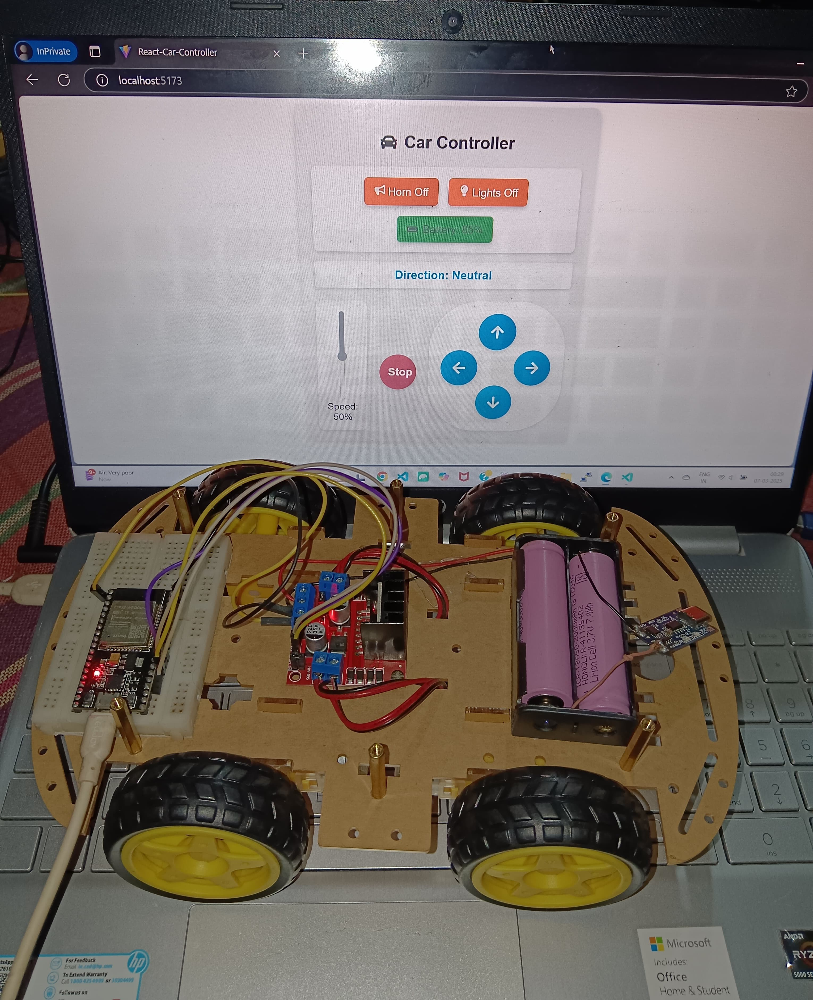
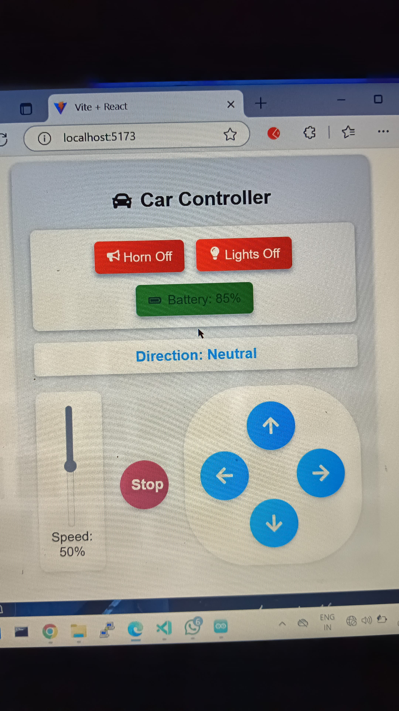

# Features of the ESP32 Car

This ESP32-based car is designed for remote control and real-time interaction. Below are its key features:

---

## 1. **WiFi Access Point (AP) Mode**
   - The ESP32 acts as a WiFi Access Point.
   - SSID: `DIY-Car`
   - Password: `DIY@1234`
   - Clients can connect directly to the car's WiFi network.

---

## 2. **WebSocket Communication**
   - Real-time communication between the car and the controller (ReactJS client) is handled via WebSocket.
   - WebSocket server runs on port `81`.

---

## 3. **Motor Control**
   - Four GPIO pins control two motors (left and right) using an H-Bridge motor driver (e.g., L298N).
   - Supported movements:
     - **Forward**
     - **Reverse**
     - **Left Turn**
     - **Right Turn**
     - **Neutral (Stop)**

---

## 4. **Headlight Control**
   - The built-in LED on the ESP32 acts as a headlight.
   - Can be turned **ON** or **OFF** via JSON commands.

---

## 5. **Horn Control**
   - A horn can be activated or deactivated via JSON commands.
   - *(Note: Requires additional hardware for sound output.)*

---

## 6. **Battery Status Monitoring**
   - The car can report its battery level (simulated in this version).
   - Battery level is included in the JSON payload.

---

## 7. **JSON-Based Command System**
   - The car accepts commands in JSON format via WebSocket.
   - Example JSON payload:
     ```json
     {
       "direction": "Forward",
       "speed": 100,
       "headlightsOn": true,
       "hornOn": false,
       "battery": 75
     }
     ```

---

## 8. **ReactJS Client**
   - A self-made ReactJS client is used to control the car.
   - Features of the ReactJS client:
     - Real-time WebSocket connection to the car.
     - Buttons for controlling direction (Forward, Reverse, Left, Right, Stop).
     - Toggle switches for headlights and horn.
     - Battery level display.
     - Responsive and user-friendly interface.

---

## 9. **Extensible Design**
   - The car's functionality can be extended with additional sensors (e.g., ultrasonic sensor for obstacle detection).
   - New features can be added to the ReactJS client for enhanced control.

---

## 10. **Open Source**
   - The code for both the ESP32 and the ReactJS client is open source.
   - Easily customizable for different use cases.

---

## Components Required

### Hardware
1. **ESP32 Development Board** - The main microcontroller for WiFi and motor control.
2. **L298N Motor Driver** - To control the direction and speed of the motors.
3. **DC Motors (4x)** - For driving the car's wheels.
4. **Wheels (4x)** - Attached to the DC motors.
5. **Chassis** - The frame of the car to hold all components.
6. **Battery Holder** - To hold the power source (e.g., 6V-12V battery pack).
7. **Jumper Wires** - For connecting components.
8. **Breadboard** - For prototyping and connecting components.
9. **Power Supply** - A 6V-12V battery pack or power adapter.
10. **LED (Optional)** - For headlights (if not using the built-in ESP32 LED).
11. **Buzzer (Optional)** - For the horn functionality.

### Software
1. **Arduino IDE** - For programming the ESP32.
2. **ReactJS** - For building the web-based control client.
3. **WebSocket Library** - For real-time communication between the ESP32 and ReactJS client.
4. **ArduinoJson Library** - For parsing JSON commands on the ESP32.

---

## Images

### ESP32 Car


### ReactJS Client Interface


---

## Learn More

### Hardware
To learn more about the hardware components used in this project, check out this guide:  
[Learn ESP32 Programming and Motor Control Hardware](./DIY-CAR)

### Software(ReactJs client)
To learn more about the software (ReactJS client development), check out this guide:  
[Learn ReactJS Development](./React-Car-Controller)

---

This car is a perfect project for learning IoT, real-time communication, and remote control systems. The combination of ESP32 and ReactJS provides a powerful and flexible platform for innovation.

## License
This project is open-source and available under the [MIT License](./License).
